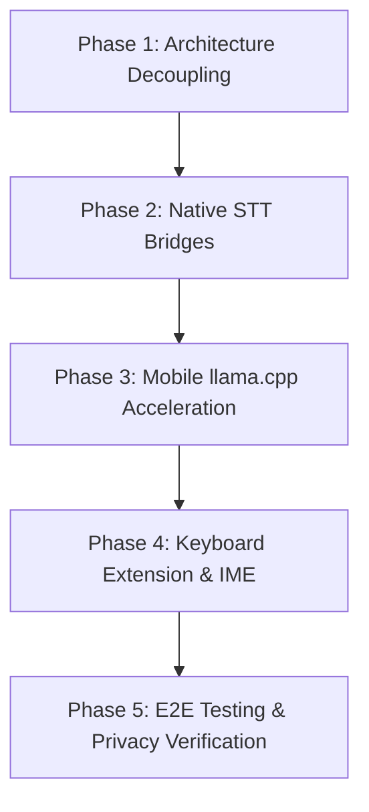

# WhisperFlow Mobile Implementation Plan: Approach 1 (Native On-Device STT + Gemma-4 E2B Cleanup)

## Executive Summary & Architectural Vision

This document outlines the engineering architecture, research findings, and step-by-step roadmap for expanding **WhisperFlow** into mobile platforms (iOS and Android).

### Core Architectural Principle
WhisperFlow employs a **hardware-adapted dual-engine strategy**:
1. **Desktop Engine (Power & Precision)**: Uses dedicated local ASR (**Qwen3-ASR 1.7B**) + **Gemma-4 E2B** via `llama-server`. Maximize accuracy on plugged-in desktop hardware.
2. **Mobile Engine (Battery & Efficiency - Approach 1)**: Uses native hardware-accelerated OS Speech Recognition (**iOS `SFSpeechRecognizer` / Android `SpeechRecognizer` in offline mode**) for zero-battery listening + **Gemma-4 E2B (Q4_K_M)** compiled via `llama.cpp` C++ FFI bindings for instantaneous post-processing and intent formatting.

> [!IMPORTANT]
> **Zero Desktop Regression Guarantee**: The desktop pipeline remains completely unchanged. Desktop users keep their high-precision Qwen3-ASR backend. The mobile strategy is an additive, decoupled layer that reuses WhisperFlow's core prompt contracts, intent detection engine, and formatting rules.

---

## 1. Deep-Dive Research: Approach 1 Evaluation

### 1.1 The Mobile Bottleneck Problem
Running a full ASR model (like Qwen3-ASR or Whisper medium.en) alongside a 2B+ LLM on a mobile device leads to severe bottlenecks:
- **Memory Pressure (OOM)**: Loading both an ASR model (~1.5 GB) and an LLM (~1.4 GB) exceeds the strict per-app RAM limits imposed by iOS (often 2GB–3GB max for non-foreground tasks).
- **Thermal & Battery Throttling**: Sustained GPU/NPU utilization for continuous audio decoding drains mobile batteries by up to 15-20% per hour and causes OS thermal throttling.

### 1.2 How Approach 1 Solves Mobile Limits
Approach 1 offloads speech-to-text to the mobile OS's native speech framework, which runs on dedicated, highly optimized system hardware chips (Apple Neural Engine / Android NPU):

| Metric | Desktop Setup (Qwen3 + Gemma) | Mobile Approach 1 (Native STT + Gemma 2B) |
|---|---|---|
| **Listening Power Draw** | ~30W – 45W (GPU/CPU) | **~0.1W – 0.5W** (System NPU) |
| **Active Memory (RAM)** | ~3.8 GB total | **~1.4 GB** (LLM loaded on-demand) |
| **Audio Processing Latency** | ~1.5s - 3s (chunked ASR) | **Instant Streaming** (native OS callback) |
| **LLM Polish Latency** | ~0.5s - 1.2s (llama-server) | **~0.4s - 0.8s** (Metal / Vulkan backend) |
| **App Bundle Size** | ~3.5 GB (models included) | **~1.4 GB** (only LLM GGUF needed) |

### 1.3 Mitigating Native STT Accuracy Degradation
Native offline speech recognition (e.g., Apple's offline dictation) is generally lighter and slightly less accurate than Qwen3-ASR with proper nouns or homophones. 

WhisperFlow mitigates this by leveraging **Gemma-4 E2B**'s system prompt instructions (`whisper_flow/prompts.py`):
1. **Phonetic & Context Correction**: The LLM infers intended words from sentence context (e.g., correcting *"there book"* to *"their book"* or recognizing technical terms from user dictionary snippets).
2. **Spoken Formatting Execution**: Spoken instructions like *"bullet list"*, *"bold that"*, or *"new paragraph"* are stripped from the raw transcript and executed as structural markdown transforms.

---

## 2. Tech Stack & Mobile Architecture

```
┌─────────────────────────────────────────────────────────────────┐
│                    MOBILE OS SYSTEM LAYER                       │
│  iOS: SFSpeechRecognizer (requiresOnDeviceRecognition = true)    │
│  Android: SpeechRecognizer (EXTRA_PREFER_OFFLINE = true)        │
└─────────────────────────────────────────────────────────────────┘
                                │ Raw Text Stream
                                ▼
┌─────────────────────────────────────────────────────────────────┐
│                  WHISPERFLOW CORE ENGINE (C++ / Rust)           │
│  - Intent Detection & Monologue Filtering                       │
│  - Dictionary & Snippet Replacement                             │
│  - Dynamic System/User Prompt Construction                     │
└─────────────────────────────────────────────────────────────────┘
                                │ Structured Prompt
                                ▼
┌─────────────────────────────────────────────────────────────────┐
│                LOCAL LLM RUNTIME (llama.cpp C++ FFI)             │
│  - iOS: Metal GPU Acceleration (gemma-4-E2B-it-Q4_K_M.gguf)     │
│  - Android: Vulkan / NNAPI Acceleration                         │
└─────────────────────────────────────────────────────────────────┘
                                │ Polished Text
                                ▼
┌─────────────────────────────────────────────────────────────────┐
│                   SYSTEM INPUT INTEGRATION                      │
│  - Custom Keyboard Extension (IME / UIInputViewController)       │
│  - Accessibility Service / Floating Action Overlay               │
└─────────────────────────────────────────────────────────────────┘
```

### 2.1 Recommended Framework Selection
- **Core Engine & Bridge**: **Rust / C++ shared core** (via `uniffi-rs` or C-bindings).
  - Reuses prompt logic, dictionary mapping, and formatting regexes cleanly across iOS, Android, and Desktop.
- **UI & System Input Layer**:
  - **iOS**: Swift + SwiftUI (`UIInputViewController` for Keyboard Extension, `SFSpeechRecognizer` for Audio).
  - **Android**: Kotlin (`InputMethodService` for Keyboard IME, `SpeechRecognizer` for Audio).
- **LLM Runtime**: Direct binding to `llama.cpp` compiled as a native static library (`.a` / `.so`) with Metal (iOS) and Vulkan/OpenCL (Android) enabled.

---

## 3. System Integration Strategy: How Users Dictate

To provide a seamless experience equivalent to the desktop hotkey (`Ctrl+Shift+Space`), mobile requires specific OS entry points:

### 3.1 iOS Integration Points
1. **Custom Keyboard Extension (`UIInputViewController`)**:
   - A dedicated mic button on the custom keyboard triggers `SFSpeechRecognizer`.
   - On release, the text is processed by `llama.cpp` in memory and inserted into the active text field using `textDocumentProxy.insertText()`.
2. **Action Extension / System Share Sheet**:
   - Allows users to highlight text in any app, send it to WhisperFlow, and run voice commands (e.g. *"Rephrase formally"*).

### 3.2 Android Integration Points
1. **Custom Input Method Editor (IME Keyboard)**:
   - Replaces or overlays the default keyboard with a high-performance dictation button.
2. **Accessibility Service / Floating Overlay (`SYSTEM_ALERT_WINDOW`)**:
   - Displays a minimal floating bubble (similar to desktop overlay) that can be dragged anywhere. Holding it records audio, cleans text, and auto-types into any active focused input via `AccessibilityNodeInfo.ACTION_SET_TEXT`.

---

## 4. Step-by-Step Implementation Roadmap



### Phase 1: Architecture Decoupling & Prompt Portability
- [ ] Refactor `prompts.py`, `intents.py`, and `formatting.py` logic into a portable spec / C-compatible interface so rules remain 100% identical between Desktop and Mobile.
- [ ] Export benchmark and prompt evaluation datasets to verify mobile LLM output parity.

### Phase 2: Native Audio & STT Binding Proof-of-Concept
- [ ] Build **iOS Proof-of-Concept** in Swift using `SFSpeechRecognizer` with strict `requiresOnDeviceRecognition = true`.
- [ ] Build **Android Proof-of-Concept** in Kotlin using `SpeechRecognizer` with `EXTRA_PREFER_OFFLINE = true`.
- [ ] Verify 100% offline functionality by testing in Airplane Mode.

### Phase 3: Mobile `llama.cpp` Compilation & Acceleration
- [ ] Compile `llama.cpp` as a universal static library for ARM64:
  - iOS target: `libllama.a` with Metal backend (`-DGGML_METAL=ON`).
  - Android target: `libllama.so` with Vulkan backend (`-DGGML_VULKAN=ON`).
- [ ] Benchmark `gemma-4-E2B-it-Q4_K_M.gguf` token generation speed and peak memory consumption on iPhone (A15+) and Android (Snapdragon 8 Gen 1+). Target: >25 tokens/sec generation, <1.4GB RAM.

### Phase 4: System Input Extensions (Keyboard & Overlays)
- [ ] Implement iOS Keyboard Extension (`UIInputViewController`) with dictation trigger and status indicator.
- [ ] Implement Android IME (`InputMethodService`) and floating bubble overlay (`SYSTEM_ALERT_WINDOW`).
- [ ] Integrate dictionary and snippet substitution engine on device.

### Phase 5: Privacy Audit & Quality Assurance
- [ ] Conduct network traffic analysis (Wireshark / Charles Proxy) during dictation to guarantee 0 outbound packets.
- [ ] Execute automated unit and regression test suite against native STT outputs.

---

## 5. Security & Privacy Guarantees

1. **Strict Offline Mode**: Both iOS and Android speech recognition calls will explicitly enforce offline flags. If offline language models are missing on the user's device, the app will prompt them to download the official OS language pack via System Settings.
2. **On-Device LLM Execution**: No API keys, server endpoints, or remote proxy servers are used. The LLM runs strictly within the app sandbox.
3. **No Telemetry**: Zero audio data, transcripts, or usage analytics are logged or transmitted externally.
